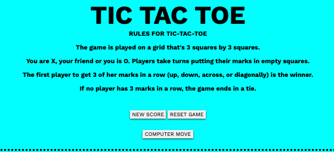
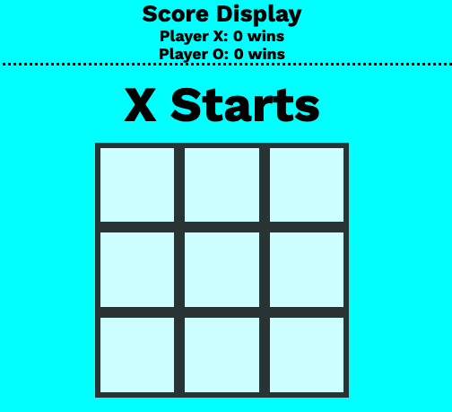

# Tic-Tac-Toe

The Tic Tac Toe Game is a classic game implemented using HTML, CSS, and vanilla JavaScript. This game allows two players to take turns marking X and O on a 3x3 grid. The objective is to get three marks in a row, either horizontally, vertically, or diagonally, while preventing the opponent from doing the same. The game includes features such as click-to-play functionality, turn tracking, win detection, draw detection, computer move, and a reset button.

To play the Tic Tac Toe Game, follow these steps:

```
1. Clone the repository or download the ZIP file.
2. Extract the files to a directory of your choice.
3. Open the index.html file in your preferred web browser.
```

Since the game is built entirely with HTML, CSS, and JavaScript, you can run it directly in your web browser without any additional setup.


## How to Play
1. When the game loads, you will see a 3x3 grid representing the Tic Tac Toe board.
2. The first player to start is X, and their turn is indicated at the top of the game board.
3. To make a move, click on any empty cell in the grid.
4. The cell will be marked with an X or O, depending on the current player's turn.
5. Players will alternate turns, and the game will automatically update the turn indicator.
6. Once a player gets three of their marks in a row horizontally, vertically, or diagonally, the game will display a message declaring the winner.
7. If all cells are filled, and there is no winner, the game will declare a draw.
8. To start a new game, click the reset button, and the game board will be cleared.
## Features

- Click-to-play functionality.
- Alternating turns between X and O.
- Preventing replay of marked cells.
- Preventing further clicks on remaining empty cells after the game ends.
- Reset button to clear the board and start a new game.
- Message display indicating the current player's turn.
- Win detection to declare a winner.
- Draw detection to declare a tie.
- Computer move that first takes defense and then offense
## Screenshots





## Tech Stack

**Client:** HTML, CSS, JavaScript

## Authors

- [@juanedcabrera](https://www.github.com/juanedcabrera)


## License

[MIT](https://choosealicense.com/licenses/mit/)

