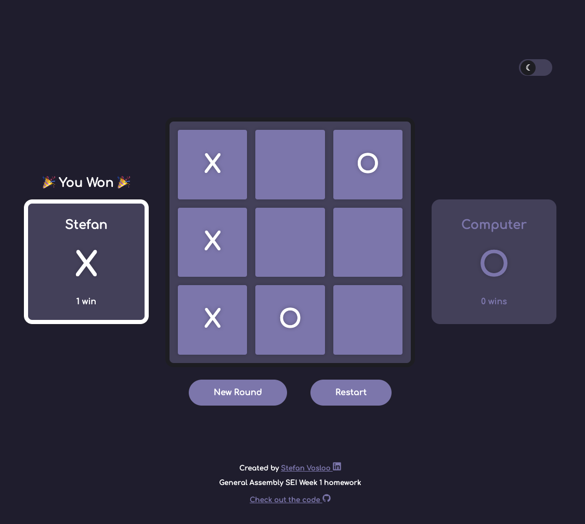
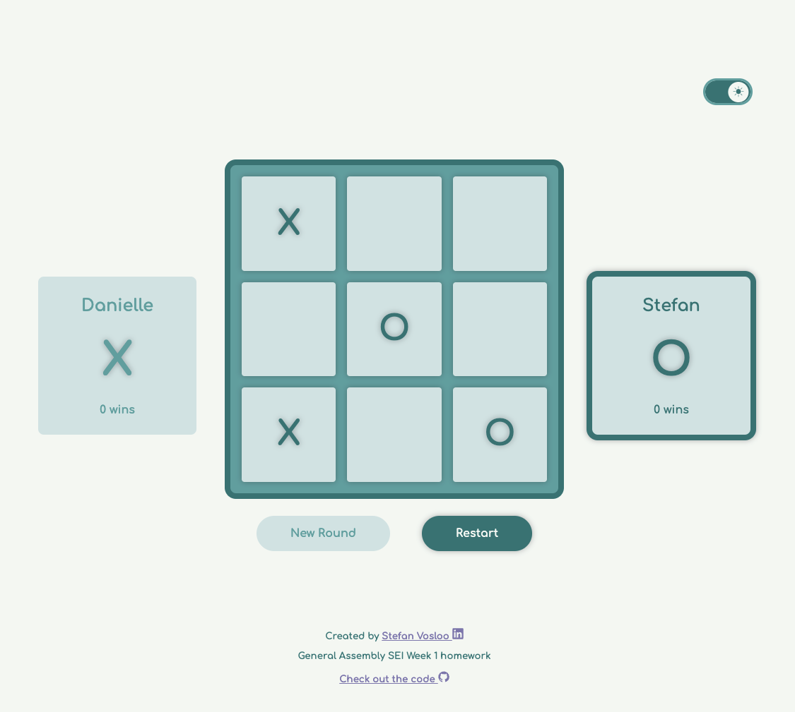

# Tic Tac Toe ⭕ ❌ ️

This is a solution to the General Assembly SEI Tic Tac Toe homework assignment.


## Table of Contents

- [Overview](#overview)
  - [The challenge](#the-challenge)
  - [Links](#links)
  - [Screenshots](#screenshots)
- [My process](#my-process)
  - [Built with](#built-with)
  - [What I learned](#what-i-learned)
  - [Resources referenced](#resources-referenced)
- [Author](#author)

## Overview

### The Challenge

Build a tic tac toe game in HTML, CSS, and vanilla JavaScript:

- [x] A user should be able to click on different squares to make a move.
- [x] Every click will alternate between marking an `X` and `O`
- [x] Upon marking of an individual cell, use JavaScript to add an `X` or `O` to the cell, according to whose turn it is.
- [x] A cell should not be able to be replayed once marked.
- [x] You should not be able to click remaining empty cells after the game is over.
- [x] Add a reset button that will clear the contents of the board.
- [x] Display a message to indicate which turn is about to be played.
- [x] Detect draw conditions (ties/cat's game)
- [x] Detect winner: Stop game and declare the winner if one player ends up getting three in a row.
- [x] **Have Fun** - The best way to learn is by playing with code. Let creativity guide you and try some experiments with JS and CSS and see what you can do.

Bonuses:

- [x] Implement your reset button without refreshing the whole page
- [x] Track player's wins over time
- [x] Add a simple AI to support one player vs computer mode. In this case, "simple" just means having the computer pick a random empty square.
- [x] Make your computer seem more human by adding a short time delay between your turn and the computer's turn.
- [x] Style it up! Get creative, or even make a theme!
- [ ] Add an AI that can beat you every time with the mini-max algorithm.

### Links

- Solution URL:

### Screenshots





## My process

### Built with

- Semantic HTML
- CSS custom properties
- Flexbox & Grid
- Vanilla JavaScript

### What I learned

- How to make a light and dark theme
- Practiced lots of JavaScript & DOM manipulation
- How to make a custom CSS toggle (checkbox). Code below. Check out the resources section for Kyle's original video on the topic.

```css
/*                  */
/* Dark Mode Toggle */
/*                  */

header {
  display: flex;
  justify-content: flex-end;
}

input[type="checkbox"].toggle {
  /* Move off the page (hide it) */
  opacity: 0;
  position: absolute;
  left: -900rem;
  top: -900rem;
}

/* Toggle + label */
input[type="checkbox"].toggle + label {
  /* Change display so that the label::before shows */
  display: flex;
  align-items: center;
  font-size: 2rem;

  position: relative;

  cursor: pointer;
}

/* Toggle background */
input[type="checkbox"].toggle + label::before {
  content: "";
  width: 2em;
  height: 1em;

  background-color: var(--dark-500);
  border-radius: 1em;
  margin-right: 0.25em;

  transition: 200ms ease-in-out;
}

/* Toggle background when checked */
input[type="checkbox"].toggle:checked + label::before {
  background-color: var(--light-800);
}

/* Toggle when focused (accessiblity feature) */
input[type="checkbox"].toggle:focus + label::before {
  outline: 0.1em solid var(--dark-200);
}
input[type="checkbox"].toggle:checked:focus + label::before {
  outline: 0.1em solid var(--light-600);
}

/* Toggle circle inside */
input[type="checkbox"].toggle + label::after {
  display: flex;
  justify-content: center;
  align-items: center;
  position: absolute;
  left: 0.2em;

  content: "☾";
  font-size: 0.5em;
  width: 1.8em;
  height: 1.8em;

  background-color: var(--dark-900);
  border-radius: 1em;
  margin-right: 0.25em;

  transition: 200ms ease-in-out;
}

/* Toggle circle inside when checked */
input[type="checkbox"].toggle:checked + label::after {
  content: "☀";
  transform: translateX(102%);
  background-color: var(--light-100);
}
```

### Resources referenced

- [CSS Toggle Buttons](https://www.youtube.com/watch?v=N8BZvfRD_eU)
- [Color Mode Toggle](https://www.youtube.com/watch?v=RiWxhm5ZdFM)
- [Random Number Generation](https://www.codecademy.com/forum_questions/50c386a4a122749bc1006ca6)
- [CSS Box Shadow](https://css-tricks.com/snippets/css/css-box-shadow/)

## Author

- LinkedIn - [Stefan Vosloo](https://www.linkedin.com/in/stefan-vosloo/)
- Twitter - [@saulthebear](https://www.twitter.com/saulthebear)
- Frontend Mentor - [@saulthebear](https://www.frontendmentor.io/profile/saulthebear)
